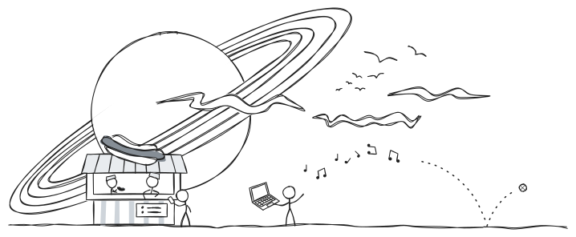
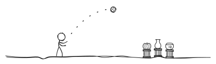
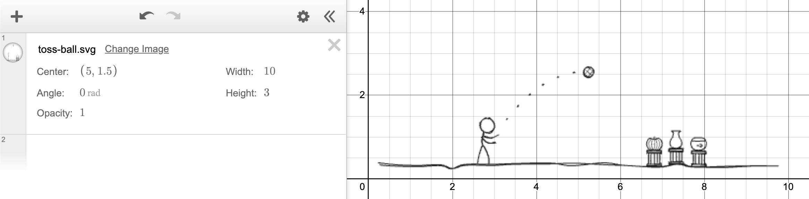
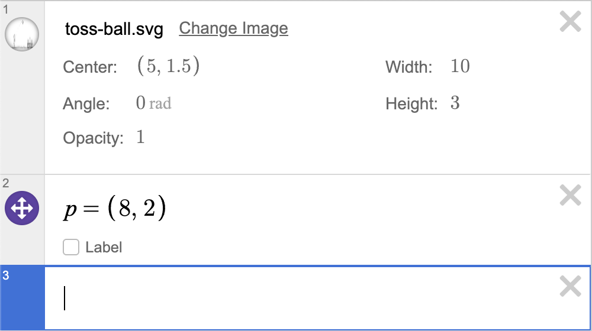
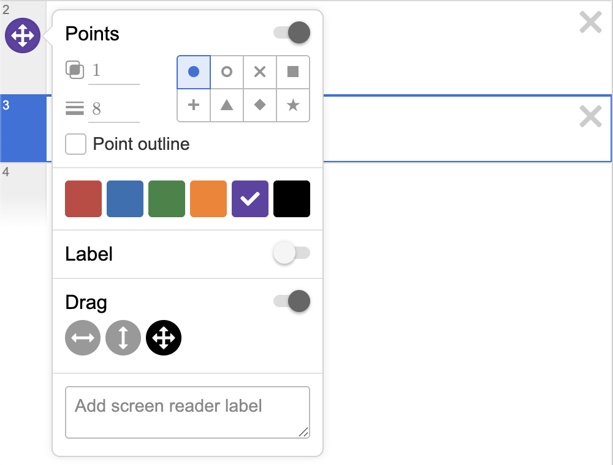
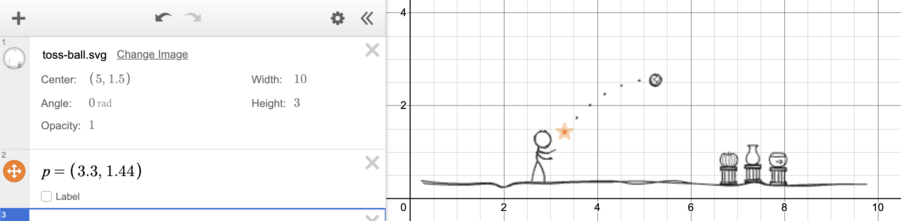
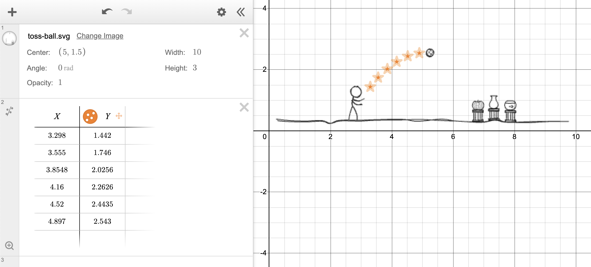
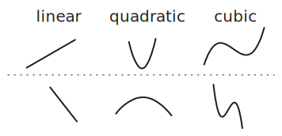
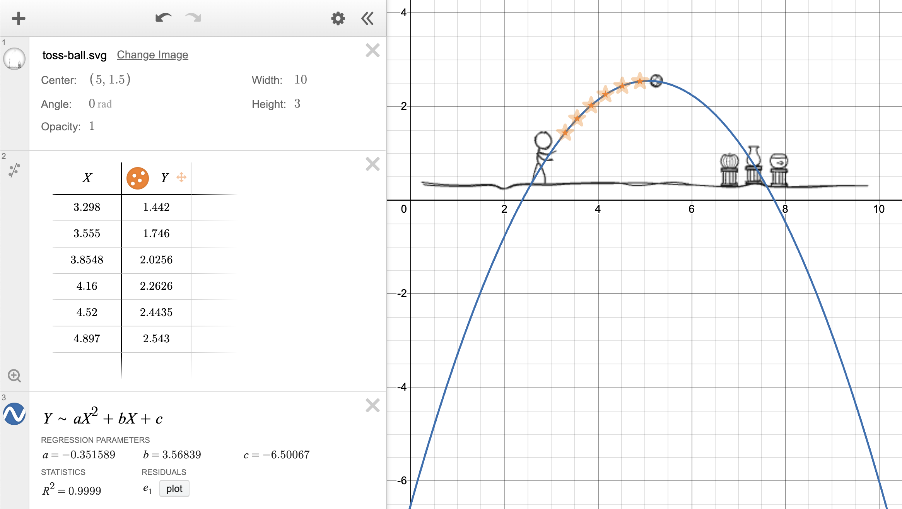

# Desmos Graphing Calculator - Example 1

## A motivating problem

A ball is thrown across a room.

Oh no!
It appears to be on a collision course
with one of the objects in the room.
Which object do you think it is going to hit?
 - The pumpkin?
 - The vase?
 - The fishbowl?
 - Nothing?

The drawing highlights part of
the trajectory of the ball using six dashes.
We can use this information together with
[Desmos Graphing Calculator](https://www.desmos.com/calculator){:target="_blank"}
to predict where the ball will go.

During this example, we will...
 1. import the image to [Desmos Graphing Calculator](https://www.desmos.com/calculator){:target="_blank"};
 2. record the location of the six points in a table;
 3. use Desmos to perform [curve fitting](https://en.wikipedia.org/wiki/Curve_fitting){:target="_blank"}
    and to draw a curve that fits the data very well.

## Importing the image

1. First, save the image to your computer so that it has the filepath
   `/Users/YOUR_NAME/Documents/UCLA-Classes/PIC-1/2-Desmos-Graphing-Calculator/toss-ball.svg`.
   In this course, we ask you to use [Google Chrome](https://www.google.com/chrome/){:target="_blank"}.
   With this browser, the simplest way to save the image is as follows.
    - Right-click (or two-finger tap) on the image.
    - Select "Save Image As..."
    - Navigate to `/Users/YOUR_NAME/Documents/UCLA-Classes/PIC-1/2-Desmos-Graphing-Calculator`.
    - Click "Save".

2. Open [Desmos Graphing Calculator](https://www.desmos.com/calculator){:target="_blank"}.
   The URL is `https://www.desmos.com/calculator`.
    - Click the plus sign $+$ which is found towards
      the top-left of the page underneath where it says "Untitled Graph".
    - Select "image".
    - Select the file you just saved and click "Open".

3. Well done!
    - You should now see the image (a little pixelated) behind the $x$- and $y$-axes.
    - To the left, you should see an entry numbered `1` that provides some information about the image.
      For example...
       - Center: $(0, 0)$
       - Width: $10$
       - Height: $3$

4. By default, the inserted image is placed behind any graphs and is not set to "draggable".
   With these settings (unless we click exactly on the center of the image)
   we can move around the plotting area by holding the mouse down and dragging.
   We can zoom in or out by using the wheel of a mouse or two fingers on a trackpad.
    - **Move the plotting area** around.
    - **Zoom** in and out.
    - **Specify a new center** for the image
      by clicking where it says $(0, 0)$
      and typing $(5,\ 1.5)$.
    - Your screen should look similar to the following screenshot.

## Creating and dragging points

The left panel in Desmos allows us to enter expressions.
Often, we will type an expression which describes something for Desmos to draw.
For example, **click on an empty entry, type** $p = (8,\ 2)$**, and hit `ENTER`**.

You should now see a point at location $(8,\ 2)$ in the $xy$-plane,
that is, above the fishbowl. **Play around with this point!**

1. **Change the values** of the coordinates of `p` and see where the point moves to.
   This functionality is useful when you have particular coordinates in mind.

2. **Drag the point around** and watch the coordinates update automatically.
   This functionality is useful when you wish to know the coordinates of a specific location.

3. **Add a label** by ticking the *check box* that says "Label".
   Now the coordinates of the point are displayed next to it.
   You can also specify another label like `my-point`.

4. **Change the color and appearance** of the point.
   To do this,
   *click and hold down* the circular icon
   next to the expression that you typed to
   bring out the *context menu* for this point.
   Clicking elsewhere will leave the context menu.

   

   With the menu open,
   change the color of the point to your preferred color and
   change its appearance to something other than the default.

5. **Toggle showing and hiding** the point
   by clicking on the circular icon
   next to the defining expression.

6. **Record the coordinates** of the
   first dash in the ball's trajectory
   by **zooming** in on the picture,
   **moving the plotting area** around,
   and **dragging the point**.

7. Well done! The coordinates for the first point are approximately
   $(3.3,\ 1.44)$.

   

8. **Create another point** and perform step 6
   for the second dash in the ball's trajectory.

## Using tables

We will store the location of the six dashes of the trajectory in a table.

1. **Create a table.**
    - Click the plus sign $+$ which is found towards
      the top-left of the page underneath where it says "Untitled Graph".
    - Select "table".
    - This creates a table with two columns labelled by $x_1$ and $y_1$.

2. **IMPORTANT.** 
   In this course, we will use *capital letters to label the data that we collect*.
   **Change the column labels** to $X$ and $Y$.
    - Click where it says $x_1$ and edit what is written to say $X$.
    - Click where it says $y_1$ and edit what is written to say $Y$.

3. **Enter approximate coordinates** for the six dashes row by row.
   As you enter the coordinates into the table,
   Desmos will plot corresponding points on the $xy$-plane to the right.
    - For the first two pairs of coordinates, you can enter the values that you found before.
    - You can now delete the two points that are not contained in the table by clicking
      the $\times$ symbol to the right of the entries where you typed to create the points.
      Be careful not to click the incorrect $\times$ and delete your image or table!
    - For the remaining four points,
      $(4,\ 2)$, $(4.25,\ 2.25)$, $(4.5,\ 2.5)$, and $(4.75,\ 2.75)$
      will do for now.

4. **Change the color and appearance** of the points.
   To do this,
   *click and hold down* the circular icon
   next to the $Y$ column label to
   bring out the context menu for these points.
   Clicking elsewhere will leave the context menu.
   With the menu open,
   change the color of the points to your preferred color and
   change their appearance to something other than the default.

5. **Make the points draggable**.
   With the context menu open, toggle "Drag" to be on.

6. **Record the coordinates** of all the
   dashes in the ball's trajectory
   more accurately
   by **zooming** in on the picture,
   **moving the plotting area** around,
   and **dragging the points**.

After you have entered and edited the coordinates of the points in the table,
your screen may look similar to the following screenshot. Good job!

## Curve fitting

Now we ask a difficult and interesting question.

> Can we find a curve that fits these points very well?

Think about some of the mathematical functions
that you encountered in secondary school.
You might have thought about making $y$
depend on $x$ in the following ways.

 - $y = a x + b$ ($y$ is a **linear** function of $x$)
 - $y = a x^2 + b x + c$ ($y$ is a **quadratic** function of $x$)
 - $y = a x^3 + b x^2 + c x + d$ ($y$ is a **cubic** function of $x$)
 - $y = a x^b$ ($y$ depends on $x$ according to some **power law**)
 - $y = a b^x$ ($y$ depends on $x$ **exponentially**)

These are not the only functions,
but we need to start somewhere by predicting
which of these functions has a graph
that most closely matches our points.
For the first three functions,
here are what the graphs might look like
(for various choices of $a$, $b$, $c$, and $d$).

**Which graph do you think fits our data points best?**

<form id="function-choice">
  <input type="radio" name="function" value="linear" id="linear">
  <label for="linear">Linear</label>
   

  <input type="radio" name="function" value="quadratic" id="quadratic">
  <label for="quadratic">Quadratic</label>
   

  <input type="radio" name="function" value="cubic" id="cubic">
  <label for="cubic">Cubic</label>
   
</form>

  

          
          
          
          
          
          
          
          

- As noted above, a quadratic curve, also known as a *parabola*, has a formula like the following one.

  

    \[y\ =\ a x^2\ +\ b x\ +\ c\]
  

  There are many different parabolas because
  there are many different values that we can pick for $a$, $b$, and $c$.
  Specifying specific values for $a$, $b$, and $c$ determines the exact shape of the graph.
  We would like to find $a$, $b$, and $c$ so that the graph fits our data really well.
  Desmos has *curve fitting* functionality.
  Having chosen the quadratic function as our *model* for the data,
  we can ask Desmos to find the best values for $a$, $b$, and $c$.

- **On the left panel, click on an empty entry, type** `Y ~ aX^2→ + bX + c`**, and hit `ENTER`**,
  so that it looks like

  

    \[Y\ \sim\ a X^2\ +\ b X\ +\ c.\]
  

  - **IMPORTANT.** This expression assumes the column names in your table are $X$ and $Y$,
    so it is important you completed step 2 [above](#using-tables).
  - **IMPORTANT.** You cannot use a lowercase $x$ and $y$
    because these variables are reserved for plotting.
  - The `~` is called *tilde* and is often found
    next to `1` on US keyboards and next to `z` on British keyboards.
    You need to use the `shift` key to type it.
  - The `^` key (`shift + 6`) will allow you to start typing a *superscript*,
    in this case, letting us square $X$.
  - To exit typing superscripted text, you will need to press the right arrow key `→`.
  - When you have finished typing, make sure your expression says $Y\ \sim\ a X^2\ +\ b X\ +\ c$.
  - Great job! After you have entered the expression correctly,
    your screen may look similar to the following screenshot.

- Desmos found the best coefficents $a$, $b$, and $c$ for a parabola to match up with our data.
  Approximately...
  

    \[\begin{aligned}
    a\ &=\ -0.35\\
    b\ &=\ +3.56\\
    c\ &=\ -6.50\\
    \end{aligned}\]
  

  In this situation, the coefficients $a$, $b$, and $c$ are called *regression parameters*
  because Desmos used a technique called regression to find these values.

- Desmos also notes that a quantity called $R^2$ has the value $0.9999$.
  Roughly speaking, $R^2$ gives a measure of how well our curve fits the data,
  and values close to $1$ are the best.

- In summary, Desmos has determined that the parabola

  

    \[y\ =\ -0.35 x^2\ +\ 3.56 x\ -\ 6.50\]
  

  fits our data really well.
  Desmos has probably already plotted the curve determined by this formula,
  but we can plot the curve directly ourselves
  to verify that this is the formula of the parabola being displayed.

- **On the left panel, click on an empty entry, type** `y = ax^2→ + bx + c`**, and hit `ENTER`**,
  so that it looks like

  

    \[y\ =\ a x^2\ +\ b x\ +\ c.\]
  

  - **IMPORTANT.** Notice the lowercase $x$ and $y$ here.
    Recall that $x$ and $y$ are reserved for plotting which is exactly what we are doing right now.
  - **IMPORTANT.** Desmos is also using the $a$, $b$, and $c$ that it learned previously
    when we asked it to fit a quadratic curve to our data.
    It has stored these values so that we can use them
    whenever it is convenient for us to do so.
  - **Toggle showing and hiding** the graphs
    by clicking on the circular icons
    to the left of the entries which specify them.

## [Problem solved](https://www.desmos.com/calculator/qc3vx9p8nq){:target="_blank"}

Which object do you think the ball is going to hit?
 - The pumpkin?
 - The vase?
 - The fishbowl?
 - Nothing?

## Food for thought

- What if we use a different model?
- How do we assess which model is correct?
- Can one provide an explanation for why a particular model works well?
  For example, why does the quadratic model work so well?

Can you think of a good name for this collection of questions?

On to [Example 2](2-2.md)!!
