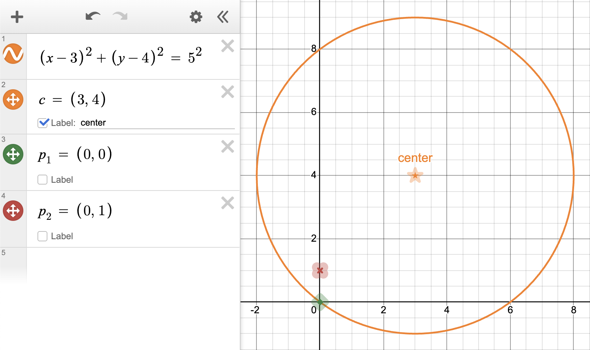
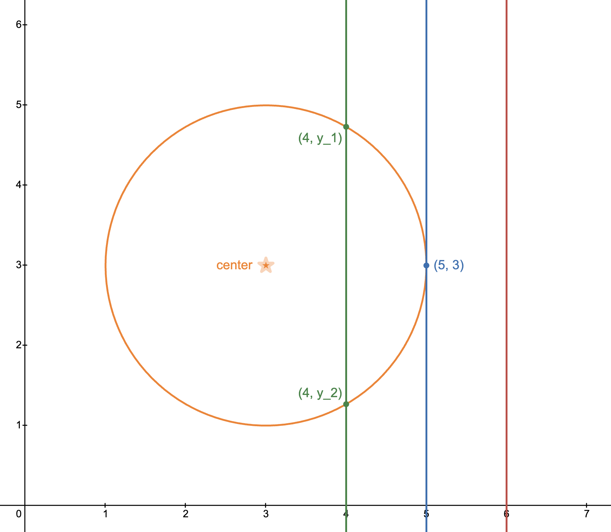
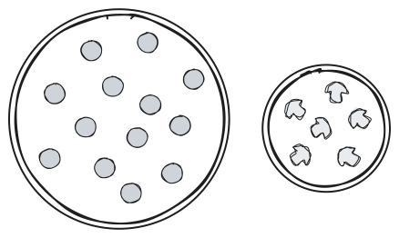
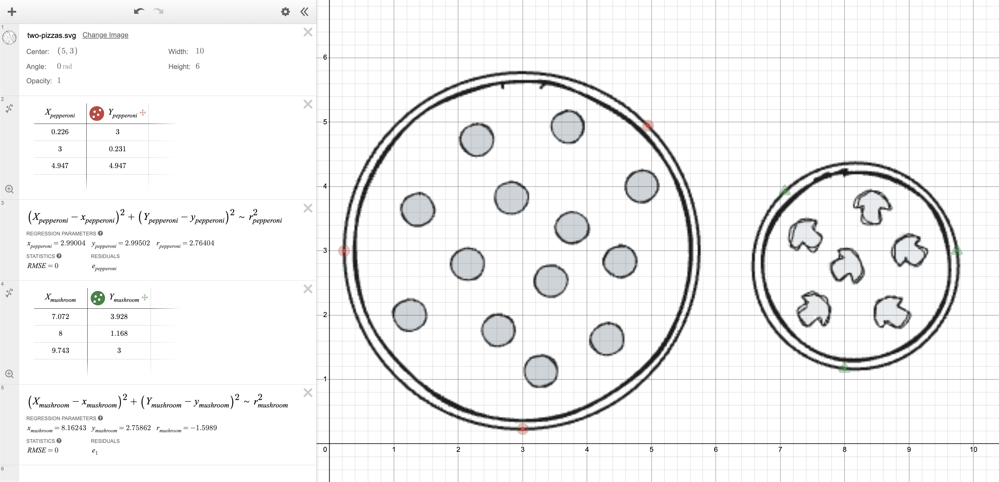
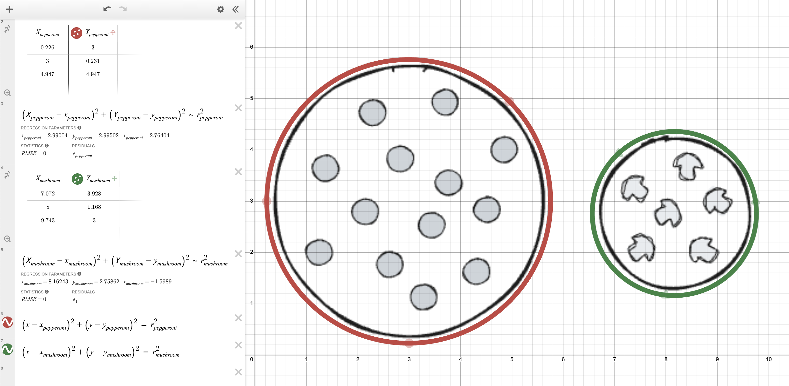
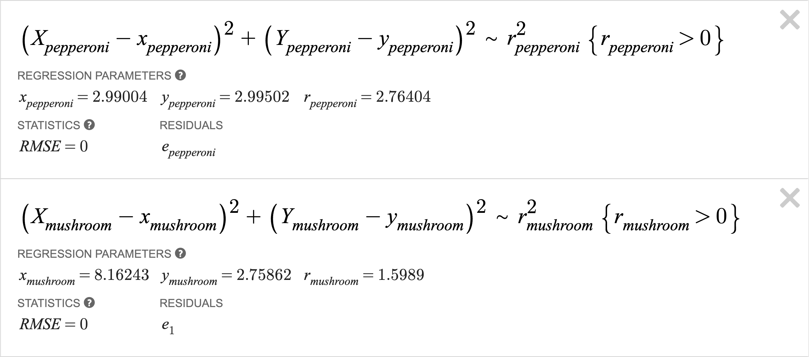

# Desmos Graphing Calculator - Example 2

## A circle - an implicitly defined curve

The equation of a circle with center $(x_0,\ y_0)$ and radius $r_0 > 0$ is given by

  \[(x - x_0)^2\ +\ (y - y_0)^2\ =\ r_0^2.\]

For example,
the equation of the circle with center $(3,\ 4)$ and radius $5$ is given by

  \[(x - 3)^2\ +\ (y - 4)^2\ =\ 5^2.\]

What does this really mean?
The circle is a collection of points with $x$ and $y$ coordinates.
Each point $(x,\ y)$ of the plane either lies on the circle or it doesn't.
**A specific point $(x,\ y)$ lies on the circle exactly when its $x$ and $y$
values make the equation above true.**

 - $(0,\ 0)$ lies on the circle with center $(3,\ 4)$ and radius $5$
   because $(0 - 3)^2\ +\ (0 - 4)^2\ =\ 5^2$.
 - $(0,\ 1)$ does *not* lie on the circle with center $(3,\ 4)$ and radius $5$
   because $(0 - 3)^2\ +\ (1 - 4)^2\ \neq\ 5^2$.

We can ask Desmos to draw many different circles by
specifying values for $x_0$, $y_0$, and $r_0$,
and typing in the first equation written above.
Have a look at [this instance of Desmos](https://www.desmos.com/calculator/402dqupgex){:target="_blank"}.

 - $x_0$ was set to be $1$ by typing `x_0→ = 1`.
   This automatically generated a slider
   where a range of values were specified by someone.
 - Similary, $y_0$ was set to be $0$ by typing `y_0→ = 0` and
   $r_0$ was set to be $2$ by typing `r_0→ = 2`.
 - The main takeaways...
    - You can introduce names for important quantities.
    - Desmos lets you edit their values intuitively.
    - You can use an underscore to start typing a *subscript*.
 - Finally, the center of the circle and the circle itself are plotted.
 - **Move the sliders around and press some of the play buttons.** 
   Pressing play for $x_0$ and $y_0$ with $r_0 = 2$ looks good
   when the plotted region is $[-10, 10]\times [-7, 7]$.

The equation for a circle is
a bit different than our previous example (a quadratic curve).
For a given $x$ coordinate, there may be...
 - no corresponding $y$ coordinate that gives
   a point $(x,\ y)$ on the circle (the red line);
 - exactly one corresponding $y$ coordinate that gives
   a point $(x,\ y)$ on the circle (the blue line);
 - or two corresponding $y$ coordinates $y_1$ and $y_2$ that give
   points $(x,\ y_1)$ and $(x,\ y_2)$ on the circle (the green line).

This is because there is not
a single explicit formula for $y$
which makes sense for all $x$.
The equation for a circle is given *implicitly*.

## Fitting an implicit curve

Amazingly, Desmos can also fit curves that are defined implicitly.
This is great because I am feeling hungry.

At the end of a long day,
you walk into your favorite pizza spot Mama's Pies
to find that there are only two options left:
a large pepperoni pizza (shown on the left) and
a small mushroom pizza (shown on the right).
The large pepperoni pizza costs \\$18.99,
the small mushroom pizza costs \\$6.99, and
you want to buy the pizza with the greater
"pizza area per dollar",
so you need to calculate...

  \[\frac{\text{area of pepperoni pizza}}{\text{cost of pepperoni pizza}}\ \ \text{and}\ \
    \frac{\text{area of mushroom pizza}}{\text{cost of mushroom pizza}}.\]

To do this, you will need the following formulae.

  \[\begin{aligned}
    A_{pepperoni}\ &=\ \pi\ r_{pepperoni}^2\\
    A_{mushroom }\ &=\ \pi\ r_{mushroom }^2
  \end{aligned}\]

We are using
$A_{pepperoni}$ and $A_{mushroom}$ for the *areas* of the two pizzas and
$r_{pepperoni}$ and $r_{mushroom}$ for the *radii* of the two pizzas.
We will ask Desmos to fit a circle around both pizzas to estimate their radii.

1. **Import the image.**
   - Save the image to your computer so that it has the filepath
     `/Users/YOUR_NAME/Documents/UCLA-Classes/PIC-1/2-Desmos-Graphing-Calculator/two-pizzas.svg`.
   - Open [Desmos Graphing Calculator](https://www.desmos.com/calculator){:target="_blank"}
     and add the image by clicking the plus sign $+$ and selecting "image".
   - Change the center of the image to $(5,\ 3)$.

2. **Create a table and add at least three points on the boundary of the pepperoni pizza.**
   - Create a table by clicking the plus sign $+$ and selecting "table".
   - Recall that in this course,
     we use *capital letters to label the data that we collect*. 
     **Change the column labels to** $X_{pepperoni}$ **and** $Y_{pepperoni}$.
      - Click where it says $x_1$ and edit what is written to say $X_{pepperoni}$ by typing `X_pepperoni`.
      - Click where it says $y_1$ and edit what is written to say $Y_{pepperoni}$ by typing `Y_pepperoni`.
   - Enter approximate coordinates for at least three points,
     for example, $(0,\ 3)$, $(3,\ 0)$, and $(5,\ 5)$.
   - Make the points draggable by
     clicking and holding down the circular icon
     next to the $Y_{pepperoni}$ column label
     (to bring out the context menu)
     and toggling "Drag" to be on.
   - Record the coordinates more accurately
     by zooming in on the picture,
     moving the plotting area around,
     and dragging the points.

3. **Fit a circle to the points.**
   From the data points, we are going to *learn*
   the center $(x_{pepperoni},\ y_{pepperoni})$ and
   radius $r_{pepperoni}$ of the pepperoni pizza.
   - Since you are about to type a long formula,
     you may want to expand the left panel.
     You can do this by moving your cursor between
     the left panel and the drawing area, and then
     clicking and dragging to expand.
   - On the left panel, click on an empty entry,
     type `(X_pepperoni→ - x_pepperoni→)^2→ + (Y_pepperoni→ - y_pepperoni→)^2→ ~ r_pepperoni→^2→`,
     and hit `ENTER`,
     so that it looks like
     

       \[(X_{pepperoni}\ -\ x_{pepperoni})^2\ +\ (Y_{pepperoni}\ -\ y_{pepperoni})^2\ \sim\ r_{pepperoni}^2.\]
     

   - **IMPORTANT.** This expression assumes the column names
     in your table are $X_{pepperoni}$ and $Y_{pepperoni}$.
     It is important that you completed *all of* step 2.
   - **IMPORTANT.** Pay special attention to
     the cases of $x$, $y$, $X$, and $Y$.
   - **IMPORTANT.** You are allowed to use lowercase
     $x_{pepperoni}$ and $y_{pepperoni}$ because
     these variables are distinct from $x$ and $y$.

4. **Repeat steps 2 and 3 for the mushroom pizza making the following changes.**
   - Use $X_{mushroom}$ and $Y_{mushroom}$ for the column names of the table.
   - Consider using $(7,\ 4)$, $(8,\ 1)$, and $(10,\ 3)$ for the approximate coordinates.
   - Enter `(X_mushroom→ - x_mushroom→)^2→ + (Y_mushroom→ - y_mushroom→)^2→ ~ r_mushroom→^2→`.

## Plotting an implicit curve

You may notice that Desmos has not plotted any circles yet.
This is because it handles curves defined by implicit equations
differently to curves defined by explicit equations.
We can plot the two circles ourselves.

1. On the left panel, click on an empty entry,
   type `(x - x_pepperoni→)^2→ + (y - y_pepperoni→)^2→ ~ r_pepperoni→^2→`,
   and hit `ENTER`, so that it looks like
   

     \[(x\ -\ x_{pepperoni})^2\ +\ (y\ -\ y_{pepperoni})^2\ \sim\ r_{pepperoni}^2.\]
   

   This draws the circle with center
   $(x_{pepperoni},\ y_{pepperoni})$ and radius $r_{pepperoni}$.

2. On the left panel, click on an empty entry,
   type `(x - x_mushroom→)^2→ + (y - y_mushroom→)^2→ ~ r_mushroom→^2→`,
   and hit `ENTER`, so that it looks like
   

     \[(x\ -\ x_{mushroom})^2\ +\ (y\ -\ y_{mushroom})^2\ \sim\ r_{mushroom}^2.\]
   

   This draws the circle with center
   $(x_{mushroom},\ y_{mushroom})$ and radius $r_{mushroom}$.

3. Notice the lowercase $x$ and $y$ here.
   Recall that $x$ and $y$ are reserved for plotting
   which is exactly what we are doing right now.
   Desmos is also using the
   $x_{pepperoni}$, $y_{pepperoni}$,    $r_{pepperoni}$,
   $x_{mushroom}$,  $y_{mushroom}$, and $r_{mushroom}$
   that it learned previously when we asked it
   to fit circles to our data.

## Constraining value ranges to obtain a better fit

You may notice that Desmos measures how good the fit is using
*RMSE (Root Mean Square Error)*. Values close to $0$ tell us
that we have a good fit.
You can also see the values
$x_{pepperoni}$, $y_{pepperoni}$,    $r_{pepperoni}$,
$x_{mushroom}$,  $y_{mushroom}$, and $r_{mushroom}$
that Desmos learned.
Some of you may see negative values
for $r_{pepperoni}$ or $r_{mushroom}$.
For example, $r_{mushroom}$ is $-1.5989$
in the screenshots above.
This does not make too much difference
because all of our formulae involve
radii squared. However, it may bug
those of you who are nitpicky!
We can fix this issue quickly.

1. In the entry where it says
   $(X_{pepperoni}\ -\ x_{pepperoni})^2$ $\ +$ $\ (Y_{pepperoni}\ -\ y_{pepperoni})^2$ $\ \sim$ $\ r_{pepperoni}^2$,
   add $\\{r_{pepperoni}>0\\}$.

2. In the entry where it says
   $(X_{mushroom}\ -\ x_{mushroom})^2$ $\ +$ $\ (Y_{mushroom}\ -\ y_{mushroom})^2$ $\ \sim$ $\ r_{mushroom}^2$,
   add $\\{r_{mushroom}>0\\}$.

$\\{r_{pepperoni}>0\\}$ is called a *constraint*.
Desmos is performing some sort of optimization and
we just constrained the values it is allowed to use.
Now Desmos will only choose from positive radii values
and so $r_{mushroom}$ is $1.5989$
in the screenshot below.
In other applications, **constraining values can be essential in order
to avoid solutions that do not make sense to the problem being solved.**

## [Problem solved](https://www.desmos.com/calculator/ojnbqmq9sb){:target="_blank"}

You can now solve the problem by entering the following formulae in Desmos.

  \[\begin{aligned}
    A_{pepperoni}\ &=\ \pi\ r_{pepperoni}^2\ &\frac{A_{pepperoni}}{18.99}\\
    A_{mushroom }\ &=\ \pi\ r_{mushroom }^2\ &\frac{A_{mushroom }}{6.99}
  \end{aligned}\]

 - $\pi$ can be typed as `pi`.
 - Fractions are created by typing `/`,
   so $\frac{A_{pepperoni}}{18.99}$ can be typed as
   `A_pepperoni→/18.99`.

Pepperoni was always going to be my choice anyway!

## Summary of conventions

If you have been a little confused by the many uses of $x$, $y$, $X$, and $Y$,
the following table may help to clarify how they are used.

| Type of quantity | Variables used                                                                                    |
| ---------------- | ------------------------------------------------------------------------------------------------- |
|     Data         | $X_{pepperoni}$ and $Y_{pepperoni}$ (in pairs), $X_{mushroom}$ and $Y_{mushroom}$ (in pairs)      |
|     Learned      | $x_{pepperoni}$, $y_{pepperoni}$, $r_{pepperoni}$, $x_{mushroom}$, $y_{mushroom}$, $r_{mushroom}$ |
|     Plotted      | $x$, $y$ (in pairs that make a specified equation true)                                           |

On to [the exercises](2-3-exercises.md)!!