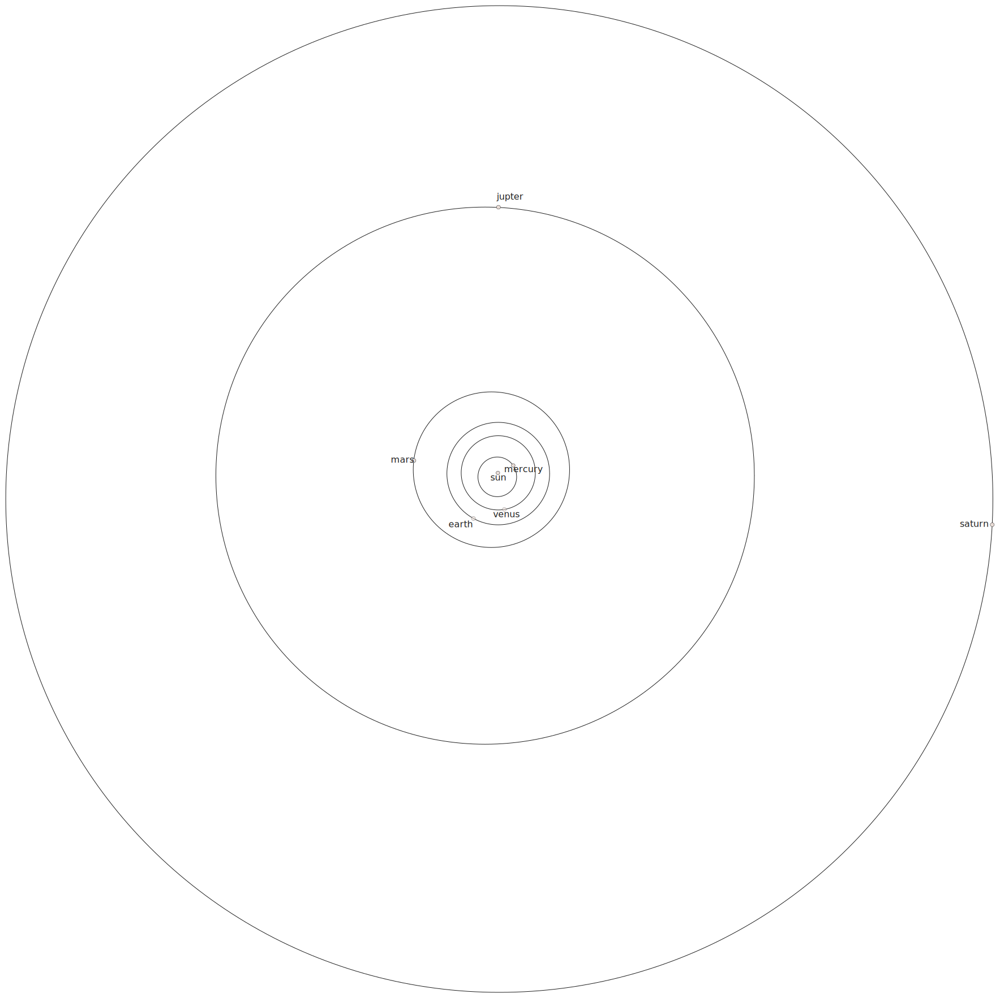

# Orbit of Saturn

A cartoon depiction of the orbits of the planets in our solar system is drawn to scale below.

 - Estimate the ratio of the radius of Saturn's orbit to the radius of Earth's orbit.
   These orbits are elliptical, but you can assume they are circular.

 - Look up the radius of the orbits of Saturn and Earth.
   How accurate is the cartoon depiction with regards to the orbits of Saturn and Earth?

