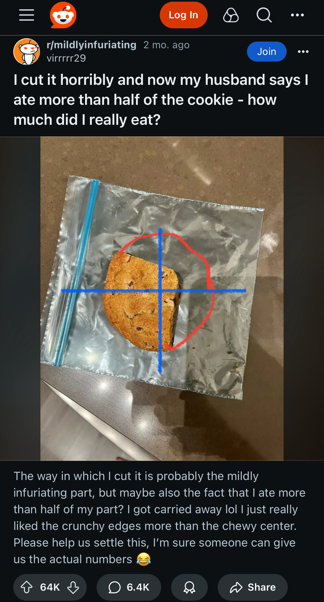
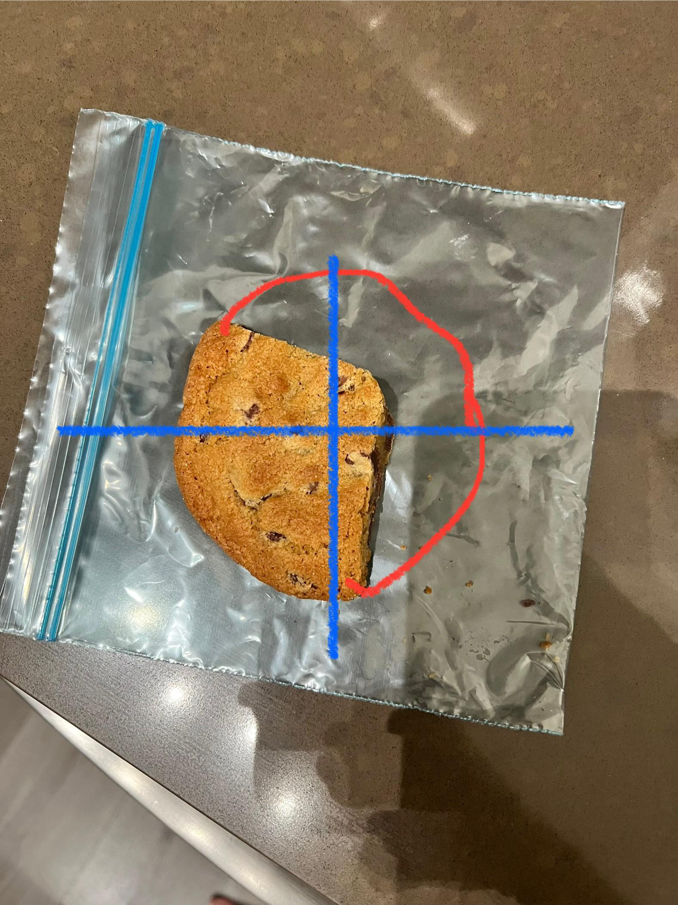

# A marriage of cookies

You are a good person,
so you wish to save the following person's marriage.

 
 
 
 

Desmos and you to the rescue!
You will help this person by taking the steps enumerated below
**using the following image** (since it will have higher resolution in Desmos).

1. **Fit a circle around the (not photographed) whole cookie.**
   To do this, make a table with columns $X_{cookie}$ and $Y_{cookie}$
   and recall that a circle's equation is as follows.
   

   	 \[(x\ -\ x_{cookie})^2\ +\ (y\ -\ y_{cookie})^2\ =\ r_{cookie}^2\]
   

   Notice and ignore that their red drawing of the cookie is not quite circular!

2. **Calculate the area of this circle.**
   Use the formula $A_{cookie}\ =\ \pi\ r_{cookie}^2$.

3. **Draw a polygon around what is left of the cookie.**

   

   - Make a table with columns called $X_{left}$ and $Y_{left}$.

   - Click on an empty entry,
     type `P_left→ = polygon(X_left→, Y_left→)`,
     and hit `ENTER`,
     so that it looks like
     

       \[P_{left}\ =\ \operatorname{polygon}(X_{left},\ Y_{left})\]
     

   - Now, as you add points to the table, a polygon is drawn.

   - **NOTE.**
     You will find that the order in which you add the points matters.
     Unfortunately, Desmos makes it difficult to reorder points
     after they have been added, so you should be as precise as
     you want to be first time through. Remember that you are a
     good person and that you want to save this person's marriage;
     using fewer than 20 points would be irresponsible!

4. **Calculate the area of this polygon using
   [Gauss' shoelace formula](https://en.wikipedia.org/wiki/Shoelace_formula#Triangle_formula){:target="_blank"}.**

   - The formula uses the number of points making up the polygon, so it is useful to store this quantity.
     
\[N\ =\ \operatorname{length}(X_{left})\]

   - The shoelace formula is as follows.
     
\[
       A_{left}\ =\ \frac{1}{2} \Bigg|
                                       \bigg( \sum_{j = 1}^{N - 1} \bigg( X_{left}[j]\ Y_{left}[j + 1]\ -\ X_{left}[j + 1]\ Y_{left}[j] \bigg) \bigg)\ 
                                    +\ \bigg(                             X_{left}[N]\ Y_{left}[    1]\ -\ X_{left}[    1]\ Y_{left}[N]        \bigg)
                                \Bigg|
     \]

     It is not important that you understand where this formula comes from.
     However, accurately typing a formula that has been verified by someone else
     is a very useful coding skill.

     First, note that
     the absolute value symbol `|` is
     near the `ENTER` key of your keyboard: `shift + \`.

     Here is how I would type the shoelace formula in Desmos.
     - `A_left→ = 1/2→ ||←() + ()←←←←←←`
     - `sum←⇠j→1→←N-1→()←`
     - `X_left→[]←j→Y_left→[]←j+1→ - X_left→[]←j+1→Y_left→[]←j→→→→→→→`
     - `X_left→[]←N→Y_left→[]←1→ - X_left→[]←1→Y_left→[]←N→→→`

     By opening and closing parentheses and square brackets
     before typing within them, I find it easier to avoid syntax errors.
     Moreover, because `()`, `[]`, and `{}` are next to each other
     on the keyboard, I often find this leads to quicker typing.

5. **Calculate the ratio $\frac{A_{left}}{A_{cookie}}$.**

   - Is it bigger than or less than $0.5$???
   - What if you purposefully
     overestimate the size of the original cookie
     and underestimate the amount left by a little bit?
   - I think the conclusion is unanimous!! Marriage saved.
