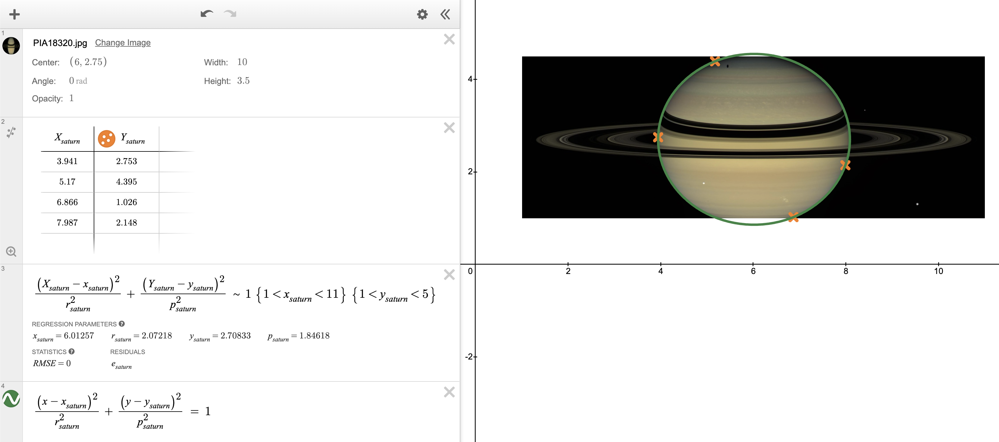

# Rings of Saturn

The image below shows Saturn and its rings.
 - Saturn looks elliptical because it bulges near the equator.
 - Its rings appear to make an ellipse due to the angle at which the image has been captured.

**YOUR TASK. Estimate the ratio $\frac{r_{ring}}{r_{saturn}}$ where$\ldots$**
 - $r_{saturn}$ is the radius of Saturn at its equator and$\ldots$
 - $r_{ring}$ is the radius of the outermost part of the **A ring**.
   This is where you would think the outermost part of all the rings are
   until you stare really hard at the image below and notice
   the **F ring**, a really, really thin ring just beyond the A ring.

To solve this problem,
you will need to fit ellipses
to Saturn and its A ring.
You can use whichever
image you prefer.

 - Like in the example with pizzas,
   it will be useful to make
   one table with column names
   $X_{saturn}$ and $Y_{saturn}$, and
   another table with column names
   $X_{ring}$ and $Y_{ring}$.

 - **You will need at least four points to fit each ellipse**.

 - **You will need the equations for two ellipses.**
   

     \[\begin{aligned}
       \frac{(x\ -\ x_{saturn})^2}{r_{saturn}^2}\ +\ \frac{(y\ -\ y_{saturn})^2}{p_{saturn}^2}\ &=\ 1\\ \\
       \frac{(x\ -\ x_{ring})^2}{r_{ring}^2}\ +\ \frac{(y\ -\ y_{ring})^2}{p_{ring}^2}\ &=\ 1
     \end{aligned}\]
   

   - $r$ is indended to stand for *radius*.
     $r_{saturn}$ and $r_{ring}$ record the radii of the ellipses in the $x$-direction,
     and these values correspond to the radii whose ratio we are trying to calculate.

   - $p_{saturn}$ and $p_{ring}$ record the radii of the ellipses in the $y$-direction.
       - For Saturn, the radius in the $y$-direction is shorter
         because of the bulge created by angular momentum.
       - For the A ring, the radius in the $y$-direction is shorter
         because of the angle at which the image has been captured.

     $p$ is vaguely intended to stand for *momentum* or *perspective*.

 - **You will also need to constrain some of the values that Desmos learns.**
   Otherwise, the values Desmos learns can be very unhelpful!

   

   - $x_{saturn}$ and $x_{ring}$ can be constrained to lie within the $x$-values of the image.
   - $y_{saturn}$ and $y_{ring}$ can be constrained to lie within the $y$-values of the image.
   - $1 < r_{saturn} < 3$ and $1 < p_{saturn} < 3$ are sensible constraints.
   - $4 < r_{ring} < 5$ and $0 < p_{ring} < 3$ are sensible constraints.
